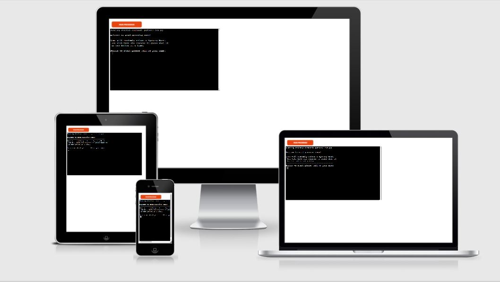
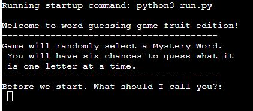
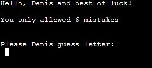
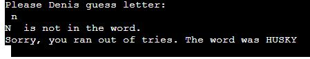
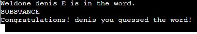
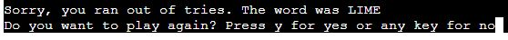
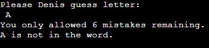
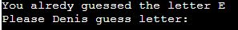
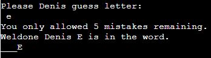
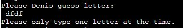

# GUESS WORD   

Guess Word is a Python terminal game, wich runs in the mock terminal on Heroku.

Main objective of game that user have to try guess mystery word.

The live link can be found here - [Guess word](https://guess-word-g.herokuapp.com/)

# Index
* [How to play Game](#How-to-play-Game)
* [Features](#Features)
* [Testing](#Testing)
* [Bugs](#Bugs)
* [Deployment](#Deployment)
* [Acknowledgements](#Acknowledgements)

# How to play Game

Game will randomly select a Mystery Word.
You will have six chances to guess what it
is one letter at a time. 

# Features

* Welcome screen
  * Welcomes user
  * Print rules of the game
  * Ask user to imput name

 
* Latter input
  * Check for letter in mystery word
  * Check if latter has been guessed
  * Returns respond if letter in word or not
  * Allow to input only one letter at the time
  * Allow only input letters
  * Gives feedback to user

  
* Game outcome
  * Show user if word guessed correct
  * Show user if ran out of mistakes allowed
  * Allow user to choose play again or not after game finished

  
## Features left to implement
* Allow user to keep high score

# Testing 
I have manually tested this project:
* Tested in my local terminal
* Input letters and checked if system respond
* Input not letters and checked if system respond
* Input multi letters and checked if system respond

# Bugs
## Solved bugs
* Writing project i had incorrect Indentation what made program stop running. 
* After installing extension in gitpod that identifies indentation errors i was able to run program

## Remaining Bugs
* No Bugs that i aware of remaining

 # Deployment
 
 This project was deployed using mock terminal for Heroku.
 * Steps for deployment:
   * Fork or clone this repository
   * Create a new Heroku app
   * Set the buildbacks to Python and NodeJS in that order
   * Link the Heroku app to the repository
   * Click on Deploy

 # Acknowledgements
 * Thank you to slack and stackowerflow community for guidence and support. 
 # Credits 
 * Only allow letters when taking user Input in Python is from https://bobbyhadz.com/blog/python-input-only-letters-allowed
 * While Loops https://www.w3schools.com/python/python_while_loops.asp

### [Go To Top](#top)
 

  
